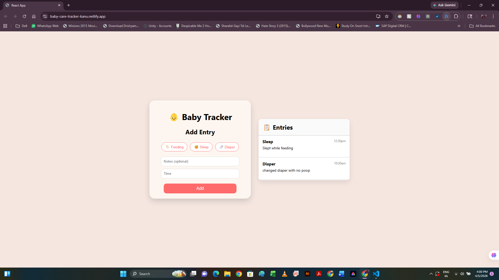

# 👶 Baby Care Tracker

A simple and clean React app to track baby activities like feeding, sleep, and diaper changes.

## 🚀 Live Demo

Vercel (Primary): https://baby-care-tracker-seven.vercel.app/

Netlify (Backup): https://baby-care-tracker-kanu.netlify.app/

---

## 📌 Features

* 🍼 Track feeding, sleep, and diaper entries
* 📝 Add notes for each entry
* ⏰ Record time for each activity
* 🗑 Delete entries
* 💾 Data persists using localStorage (no data loss on refresh)
* 📋 Clean and scrollable list view
* 🎨 Simple and user-friendly UI

---

## 🛠 Tech Stack

* React.js
* JavaScript
* CSS
* Browser localStorage

---

## 📷 Screenshot



---

## ⚙️ Installation

```bash
git clone https://github.com/KanupriyaVerma/baby-care-tracker.git
cd baby-care-tracker
npm install
npm start
```

---

## 💡 Why I built this

This project was built to practice React fundamentals like state management, component structure, and building a real-world useful application.

---

## 🔮 Future Improvements

* ✏️ Edit existing entries
* 🔍 Add filters (by type/date)
* 📱 Improve mobile responsiveness
* ☁️ Add backend (save data permanently)

---

## 🙌 Author

**Kanupriya Verma**
